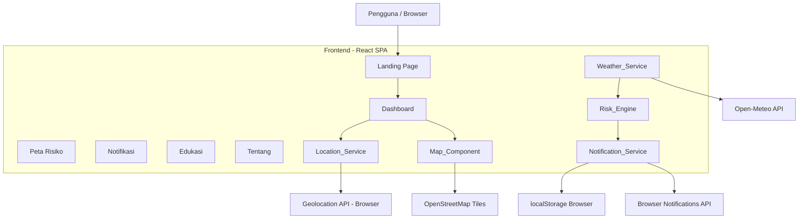
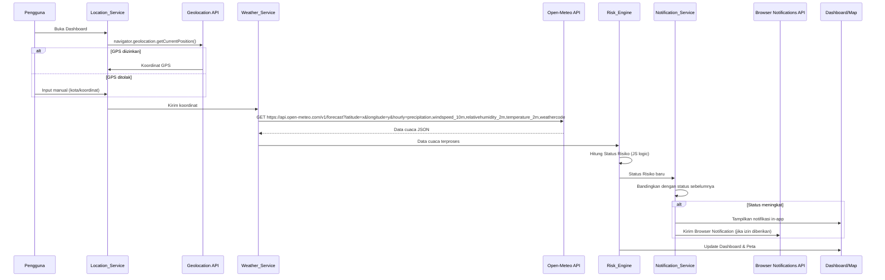

# Dokumen Desain Teknis: DisasterSense AI

## Ikhtisar (Overview)

DisasterSense AI adalah aplikasi web kesiapsiagaan bencana yang menganalisis data cuaca real-time untuk memprediksi risiko bencana alam di Indonesia. Sistem mengambil data dari Open-Meteo API (gratis, tanpa API key), memprosesnya melalui rule-based engine berbasis JavaScript murni, dan menyajikan hasil analisis kepada pengguna melalui dashboard interaktif, peta risiko, dan sistem notifikasi peringatan dini menggunakan Browser Notifications API.

### Tujuan Teknis

- Memberikan analisis risiko bencana berbasis lokasi secara real-time
- Membangun sistem yang berjalan sepenuhnya di atas layanan gratis tanpa API key berbayar (Open-Meteo, OpenStreetMap, Geolocation API browser, Browser Notifications API)
- Menyediakan antarmuka responsif yang dapat diakses dari desktop maupun mobile
- Mengimplementasikan logika AI rule-based dengan JavaScript murni yang deterministik dan dapat diaudit

### Batasan Teknis

- Open-Meteo API: gratis tanpa API key, tidak ada rate limit ketat untuk penggunaan wajar
- Tidak ada backend — frontend React memanggil Open-Meteo API langsung (tidak perlu proxy karena tidak ada API key yang perlu disembunyikan)
- Tidak ada backend persistensi — riwayat notifikasi disimpan di `localStorage` browser
- Logika AI sepenuhnya rule-based dengan JavaScript murni, tidak menggunakan model ML atau library eksternal

---

## Arsitektur (Architecture)

Sistem menggunakan arsitektur **Single Page Application (SPA)** dengan React di frontend. Karena Open-Meteo tidak memerlukan API key, frontend dapat memanggil API cuaca secara langsung tanpa backend proxy.



### Alur Data Utama



---

## Komponen dan Antarmuka (Components and Interfaces)

### Frontend Components

#### `Location_Service`
Mengelola deteksi dan validasi lokasi pengguna.

```typescript
interface LocationData {
  lat: number;       // -90 hingga 90
  lon: number;       // -180 hingga 180
  cityName: string;  // nama kota hasil reverse geocoding atau input manual
  source: 'gps' | 'manual';
}

interface LocationService {
  detectGPS(): Promise<LocationData>;
  parseManualInput(input: string): LocationData | null;
  validateCoordinates(lat: number, lon: number): boolean;
  getCurrentLocation(): LocationData | null;
}
```

#### `Weather_Service`
Mengambil dan memproses data cuaca langsung dari Open-Meteo API (tanpa backend proxy).

```typescript
interface WeatherData {
  rainfall: number;       // mm/jam (dari field: precipitation)
  windSpeed: number;      // km/jam (dari field: windspeed_10m)
  humidity: number;       // % (dari field: relativehumidity_2m)
  temperature: number;    // °C (dari field: temperature_2m)
  weatherCode: number;    // kode cuaca WMO (dari field: weathercode)
  timestamp: number;      // Unix timestamp pengambilan data
  isStale: boolean;       // true jika data lebih dari 10 menit
}

interface WeatherService {
  fetchWeather(location: LocationData): Promise<WeatherData>;
  startPolling(location: LocationData, intervalMs: number): void;
  stopPolling(): void;
  getLastWeatherData(): WeatherData | null;
}
```

#### `Risk_Engine`
Menghitung Status Risiko berdasarkan aturan yang telah ditentukan.

```typescript
type RiskStatus = 'Aman' | 'Waspada' | 'Bahaya';

interface RiskResult {
  status: RiskStatus;
  triggeringFactors: string[];   // parameter yang memicu klasifikasi
  recommendations: string[];     // daftar rekomendasi tindakan
  calculatedAt: number;          // Unix timestamp kalkulasi
  isStale: boolean;              // true jika berdasarkan data cuaca lama
}

interface RiskEngine {
  calculate(weather: WeatherData): RiskResult;
  getRecommendations(status: RiskStatus): string[];
  getLastResult(): RiskResult | null;
}
```

#### `Notification_Service`
Mengelola pembuatan, penyimpanan, dan pengiriman peringatan dini via in-app dan Browser Notifications API.

```typescript
interface AlertEntry {
  id: string;
  timestamp: number;
  location: string;
  previousStatus: RiskStatus;
  newStatus: RiskStatus;
  weatherSnapshot: WeatherData;
}

interface NotificationService {
  checkAndAlert(previous: RiskResult | null, current: RiskResult): AlertEntry | null;
  requestBrowserPermission(): Promise<NotificationPermission>;
  sendBrowserNotification(alert: AlertEntry): void;
  getAlertHistory(): AlertEntry[];
  clearHistory(): void;
}
```

#### `Map_Component`
Komponen peta interaktif berbasis Leaflet.js.

```typescript
interface MapMarker {
  lat: number;
  lon: number;
  status: RiskStatus;
  label: string;
  weatherSummary: string;
}

interface MapComponent {
  initialize(containerId: string): void;
  centerOn(lat: number, lon: number, zoom?: number): void;
  addMarker(marker: MapMarker): void;
  updateMarkerStatus(markerId: string, status: RiskStatus): void;
  addRiskOverlay(zones: RiskZone[]): void;
}
```

### Backend API (Node.js / Express)

Backend Node.js tidak diperlukan untuk proxy API cuaca karena Open-Meteo tidak memerlukan API key. Frontend React memanggil Open-Meteo secara langsung.

#### Open-Meteo API (dipanggil langsung dari frontend)

```
Endpoint: GET https://api.open-meteo.com/v1/forecast

Query params yang digunakan:
  latitude: number          (required) — lintang lokasi
  longitude: number         (required) — bujur lokasi
  hourly: string            = "precipitation,windspeed_10m,relativehumidity_2m,temperature_2m,weathercode"
  forecast_days: number     = 1
  timezone: string          = "Asia/Jakarta"

Response 200 (contoh):
  {
    "latitude": -6.2,
    "longitude": 106.8,
    "hourly": {
      "time": ["2024-01-01T00:00", ...],
      "precipitation": [0.0, 1.2, ...],
      "windspeed_10m": [12.5, 15.0, ...],
      "relativehumidity_2m": [80, 85, ...],
      "temperature_2m": [28.0, 27.5, ...],
      "weathercode": [0, 61, ...]
    }
  }
```

Weather_Service mengambil nilai jam terdekat dari array `hourly` berdasarkan waktu saat ini.

#### Geocoding (Nominatim / OpenStreetMap)

Untuk konversi nama kota ke koordinat, digunakan Nominatim API (gratis, tanpa API key):

```
Endpoint: GET https://nominatim.openstreetmap.org/search

Query params:
  q: string       (nama kota)
  format: string  = "json"
  limit: number   = 1

Response 200:
  [{ "lat": "-6.2", "lon": "106.8", "display_name": "Jakarta, ..." }]
```

---

## Model Data (Data Models)

### State Management (React Context / Zustand)

```typescript
interface WeatherData {
  rainfall: number;       // mm/jam (precipitation)
  windSpeed: number;      // km/jam (windspeed_10m)
  humidity: number;       // % (relativehumidity_2m)
  temperature: number;    // °C (temperature_2m)
  weatherCode: number;    // kode cuaca WMO (weathercode)
  timestamp: number;      // Unix timestamp pengambilan data
  isStale: boolean;
}
```

### State Management (React Context / Zustand)

```typescript
interface AppState {
  location: LocationData | null;
  weather: WeatherData | null;
  riskResult: RiskResult | null;
  alerts: AlertEntry[];
  isLoadingWeather: boolean;
  weatherError: string | null;
}
```

### Aturan Risk Engine (Rule Table)

| Kondisi | Status Risiko |
|---|---|
| curah_hujan < 10 mm/jam DAN kecepatan_angin < 40 km/jam | Aman |
| curah_hujan 10–50 mm/jam ATAU kecepatan_angin 40–70 km/jam | Waspada |
| curah_hujan > 50 mm/jam ATAU kecepatan_angin > 70 km/jam | Bahaya |

Prioritas: **Bahaya > Waspada > Aman** (kondisi terburuk yang terpenuhi menentukan status akhir).

### Rekomendasi Tindakan (Static Data)

```typescript
const RECOMMENDATIONS: Record<RiskStatus, string[]> = {
  Aman: [
    "Pantau prakiraan cuaca secara berkala",
  ],
  Waspada: [
    "Siapkan tas darurat berisi dokumen penting",
    "Periksa saluran air di sekitar rumah",
    "Pantau informasi dari BMKG dan pemerintah setempat",
  ],
  Bahaya: [
    "Segera evakuasi ke tempat yang lebih tinggi",
    "Hubungi nomor darurat: 119 (BNPB) atau 112",
    "Jauhi saluran air, sungai, dan daerah rawan longsor",
    "Matikan aliran listrik jika air mulai masuk rumah",
    "Ikuti instruksi petugas evakuasi setempat",
  ],
};
```

### Penyimpanan Lokal (localStorage Schema)

```typescript
// Key: "disastersense_alerts"
// Value: JSON.stringify(AlertEntry[])

// Key: "disastersense_last_location"
// Value: JSON.stringify(LocationData)
```

---

## Properti Kebenaran (Correctness Properties)

*Sebuah properti adalah karakteristik atau perilaku yang harus berlaku di semua eksekusi valid suatu sistem — pada dasarnya, pernyataan formal tentang apa yang seharusnya dilakukan sistem. Properti berfungsi sebagai jembatan antara spesifikasi yang dapat dibaca manusia dan jaminan kebenaran yang dapat diverifikasi oleh mesin.*


### Properti 1: Presisi Koordinat GPS

*Untuk setiap* koordinat yang diterima dari GPS browser, nilai lintang dan bujur yang disimpan oleh Location_Service harus memiliki presisi minimal 4 digit desimal.

**Memvalidasi: Kebutuhan 1.1**

---

### Properti 2: Validasi Rentang Koordinat

*Untuk setiap* pasangan nilai lintang dan bujur, Location_Service harus menerima input jika dan hanya jika lintang berada dalam rentang [-90, 90] dan bujur dalam rentang [-180, 180].

**Memvalidasi: Kebutuhan 1.3**

---

### Properti 3: Input Tidak Valid Menghasilkan Error

*Untuk setiap* input koordinat yang berada di luar rentang valid atau string yang tidak dapat dikenali sebagai nama kota, Location_Service harus mengembalikan pesan kesalahan (bukan null atau data lokasi).

**Memvalidasi: Kebutuhan 1.4**

---

### Properti 4: Round-Trip Penyimpanan Lokasi

*Untuk setiap* LocationData yang berhasil ditentukan, memanggil `getCurrentLocation()` setelah penyimpanan harus mengembalikan objek dengan nilai lat, lon, dan cityName yang identik.

**Memvalidasi: Kebutuhan 1.5**

---

### Properti 5: Kelengkapan Field Data Cuaca

*Untuk setiap* respons yang berhasil dari Weather_Service (Open-Meteo), objek WeatherData yang dihasilkan harus memiliki semua field berikut dengan nilai yang terdefinisi: `rainfall`, `windSpeed`, `humidity`, `temperature`, `weatherCode`, dan `timestamp`.

**Memvalidasi: Kebutuhan 2.2**

---

### Properti 6: Klasifikasi Risiko Sesuai Aturan

*Untuk setiap* objek WeatherData yang valid, Risk_Engine harus menghasilkan:
- Status `Aman` jika dan hanya jika `rainfall < 10` DAN `windSpeed < 40`
- Status `Bahaya` jika `rainfall > 50` ATAU `windSpeed > 70`
- Status `Waspada` untuk semua kondisi lainnya

**Memvalidasi: Kebutuhan 3.1, 3.2**

---

### Properti 7: Faktor Pemicu Selalu Disertakan

*Untuk setiap* kalkulasi Risk_Engine yang menghasilkan status `Waspada` atau `Bahaya`, array `triggeringFactors` dalam RiskResult harus berisi setidaknya satu string yang mendeskripsikan parameter cuaca yang memicu klasifikasi tersebut.

**Memvalidasi: Kebutuhan 3.3**

---

### Properti 8: Pertahanan Status Saat Data Tidak Lengkap

*Untuk setiap* kondisi di mana data cuaca tidak tersedia atau tidak lengkap (field yang diperlukan bernilai null/undefined), Risk_Engine harus mengembalikan RiskResult terakhir yang valid dengan `isStale: true`, bukan menghasilkan status baru.

**Memvalidasi: Kebutuhan 3.5**

---

### Properti 9: Kelengkapan Tampilan Dashboard

*Untuk setiap* AppState yang memiliki lokasi, data cuaca, dan riskResult yang valid, komponen Dashboard harus me-render elemen yang mengandung: nama lokasi, nilai cuaca terkini, Status Risiko, dan setidaknya satu rekomendasi tindakan.

**Memvalidasi: Kebutuhan 4.1, 7.4**

---

### Properti 10: Konsistensi Pemetaan Warna Status Risiko

*Untuk setiap* nilai RiskStatus yang mungkin, representasi warna yang digunakan di Dashboard dan marker peta harus konsisten: `Aman` → hijau (`#22c55e` atau setara), `Waspada` → kuning/oranye (`#f59e0b` atau setara), `Bahaya` → merah (`#ef4444` atau setara).

**Memvalidasi: Kebutuhan 4.2, 6.2**

---

### Properti 11: Entri Peringatan Dibuat Saat Status Meningkat

*Untuk setiap* pasangan (status_sebelumnya, status_baru) di mana status_baru lebih tinggi dari status_sebelumnya (Aman < Waspada < Bahaya), `checkAndAlert()` harus mengembalikan AlertEntry yang berisi timestamp, lokasi, previousStatus, dan newStatus yang benar. Untuk pasangan di mana status tidak meningkat, harus mengembalikan null.

**Memvalidasi: Kebutuhan 5.1**

---

### Properti 16: Browser Notification Dikirim Saat Izin Diberikan

*Untuk setiap* AlertEntry yang dibuat saat status meningkat, jika `Notification.permission === 'granted'`, maka `sendBrowserNotification()` harus dipanggil dengan data peringatan yang sesuai.

**Memvalidasi: Kebutuhan 5.5**

---

### Properti 12: Round-Trip Penyimpanan Riwayat Peringatan

*Untuk setiap* serangkaian AlertEntry yang ditambahkan ke Notification_Service, memanggil `getAlertHistory()` harus mengembalikan semua entri yang telah ditambahkan, tanpa ada yang hilang.

**Memvalidasi: Kebutuhan 5.3**

---

### Properti 13: Urutan Riwayat Peringatan Descending

*Untuk setiap* koleksi AlertEntry dengan timestamp yang berbeda, `getAlertHistory()` harus mengembalikan array yang diurutkan sehingga `alerts[i].timestamp >= alerts[i+1].timestamp` untuk semua indeks i yang valid.

**Memvalidasi: Kebutuhan 5.4**

---

### Properti 14: Jumlah Minimum Rekomendasi Per Status

*Untuk setiap* nilai RiskStatus, `getRecommendations()` harus mengembalikan array dengan jumlah item minimal sesuai status: `Aman` → ≥ 1 item, `Waspada` → ≥ 3 item, `Bahaya` → ≥ 5 item.

**Memvalidasi: Kebutuhan 7.1, 7.2, 7.3**

---

### Properti 15: Kelengkapan Struktur Data Edukasi

*Untuk setiap* entri panduan bencana dalam data edukasi, objek tersebut harus memiliki semua field berikut dengan nilai yang terdefinisi dan tidak kosong: `description`, `warningSigns`, `beforeSteps`, `duringSteps`, `afterSteps`, dan `checklist` (array dengan minimal satu item).

**Memvalidasi: Kebutuhan 8.2, 8.3**

---

## Penanganan Error (Error Handling)

### Strategi Umum

Semua error ditangani secara graceful — aplikasi tidak boleh crash atau menampilkan layar putih kosong akibat kegagalan layanan eksternal.

### Skenario Error dan Penanganannya

| Skenario | Komponen | Penanganan |
|---|---|---|
| GPS ditolak pengguna | Location_Service | Tampilkan form input manual |
| Input koordinat tidak valid | Location_Service | Tampilkan pesan error deskriptif, jangan proses lebih lanjut |
| Open-Meteo API timeout (>5 detik) | Weather_Service | Tampilkan data terakhir dengan label "Data terakhir diperbarui: [waktu]", set `isStale: true` |
| Open-Meteo API error (4xx/5xx) | Weather_Service | Tampilkan banner "Data cuaca sementara tidak tersedia", pertahankan data terakhir |
| Data cuaca tidak lengkap | Risk_Engine | Pertahankan RiskResult terakhir, set `isStale: true` |
| localStorage penuh | Notification_Service | Hapus entri terlama (FIFO), simpan entri baru |
| Tile peta gagal dimuat | Map_Component | Tampilkan peta dengan tile fallback atau pesan "Peta tidak tersedia" |

### Error Boundaries (React)

Setiap halaman utama (Dashboard, Peta, Notifikasi, Edukasi) dibungkus dengan React Error Boundary untuk mencegah crash propagasi ke seluruh aplikasi.

---

## Strategi Pengujian (Testing Strategy)

### Pendekatan Dual Testing

Sistem menggunakan dua pendekatan pengujian yang saling melengkapi:

1. **Unit Tests**: Memverifikasi contoh spesifik, kasus tepi, dan kondisi error
2. **Property-Based Tests**: Memverifikasi properti universal di seluruh input yang mungkin

### Library yang Digunakan

- **Unit Testing**: [Vitest](https://vitest.dev/) + [React Testing Library](https://testing-library.com/docs/react-testing-library/intro/)
- **Property-Based Testing**: [fast-check](https://fast-check.dev/) (TypeScript/JavaScript)

### Konfigurasi Property-Based Testing

Setiap property test dikonfigurasi dengan minimal **100 iterasi** untuk memastikan coverage yang memadai:

```typescript
import fc from 'fast-check';

// Contoh konfigurasi
fc.assert(
  fc.property(fc.float({ min: -90, max: 90 }), fc.float({ min: -180, max: 180 }), (lat, lon) => {
    // ... test body
  }),
  { numRuns: 100 }
);
```

Setiap property test harus diberi tag komentar dengan format:
```
// Feature: disastersense-ai, Property {nomor}: {teks properti}
```

### Pemetaan Property Test ke Properti Desain

| Property Test | Properti Desain | Komponen |
|---|---|---|
| Presisi koordinat GPS | Properti 1 | Location_Service |
| Validasi rentang koordinat | Properti 2 | Location_Service |
| Input tidak valid → error | Properti 3 | Location_Service |
| Round-trip penyimpanan lokasi | Properti 4 | Location_Service |
| Kelengkapan field data cuaca | Properti 5 | Weather_Service |
| Klasifikasi risiko sesuai aturan | Properti 6 | Risk_Engine |
| Faktor pemicu selalu disertakan | Properti 7 | Risk_Engine |
| Pertahanan status saat data tidak lengkap | Properti 8 | Risk_Engine |
| Kelengkapan tampilan Dashboard | Properti 9 | Dashboard |
| Konsistensi pemetaan warna | Properti 10 | Dashboard, Map_Component |
| Entri peringatan saat status meningkat | Properti 11 | Notification_Service |
| Browser notification saat izin diberikan | Properti 16 | Notification_Service |
| Round-trip penyimpanan riwayat | Properti 12 | Notification_Service |
| Urutan riwayat descending | Properti 13 | Notification_Service |
| Jumlah minimum rekomendasi | Properti 14 | Risk_Engine |
| Kelengkapan struktur data edukasi | Properti 15 | Education data |

### Unit Tests (Contoh Spesifik dan Kasus Tepi)

Unit test difokuskan pada:
- Contoh konkret yang mendemonstrasikan perilaku benar (misal: curah hujan = 25 mm/jam → status Waspada)
- Kondisi batas aturan risk engine (misal: tepat 10 mm/jam, tepat 50 mm/jam)
- Kondisi error (misal: Open-Meteo timeout, input kosong)
- Integrasi antar komponen (misal: Weather_Service → Risk_Engine → Notification_Service)
- Perilaku UI saat loading, error, dan sukses

### Cakupan Pengujian yang Ditargetkan

- **Risk_Engine**: 100% branch coverage (semua kombinasi aturan)
- **Location_Service**: 100% branch coverage (GPS, manual, validasi)
- **Notification_Service**: 100% branch coverage (semua transisi status)
- **Weather_Service**: 80%+ coverage (mock API responses)
- **Komponen UI**: 70%+ coverage (render states utama)
