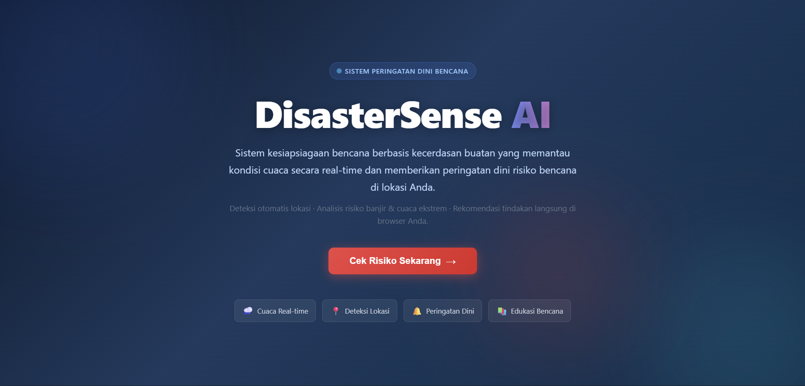
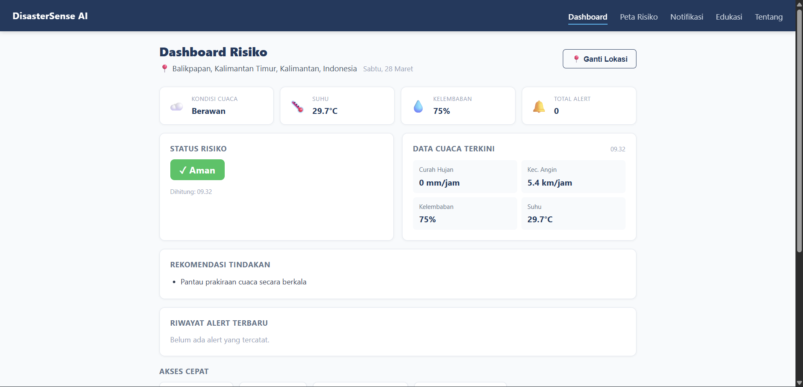
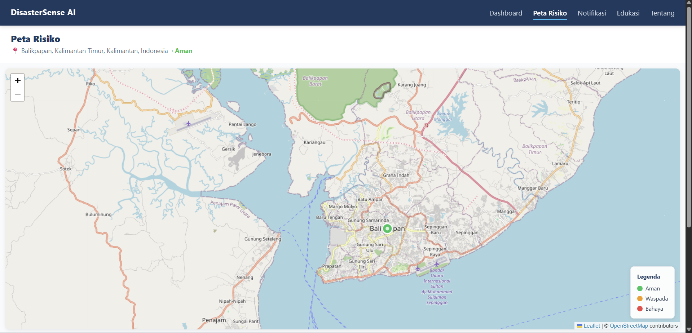
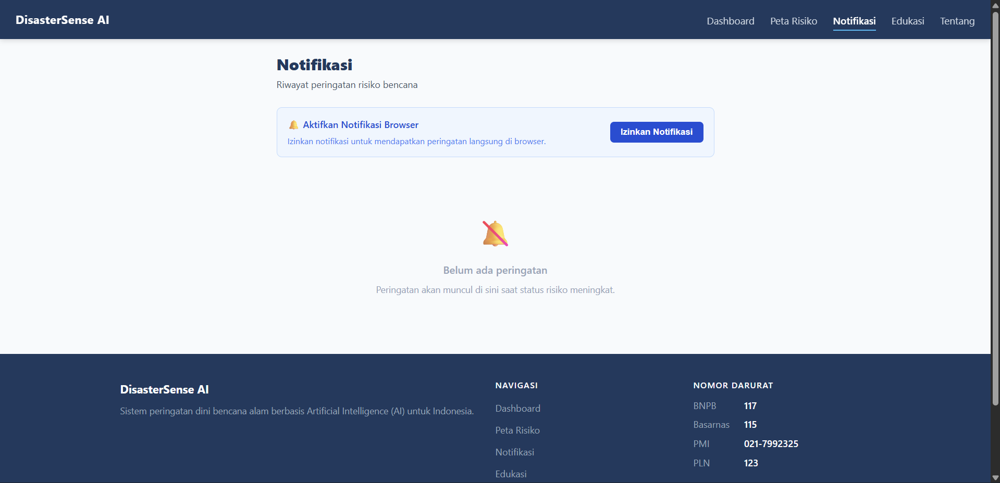
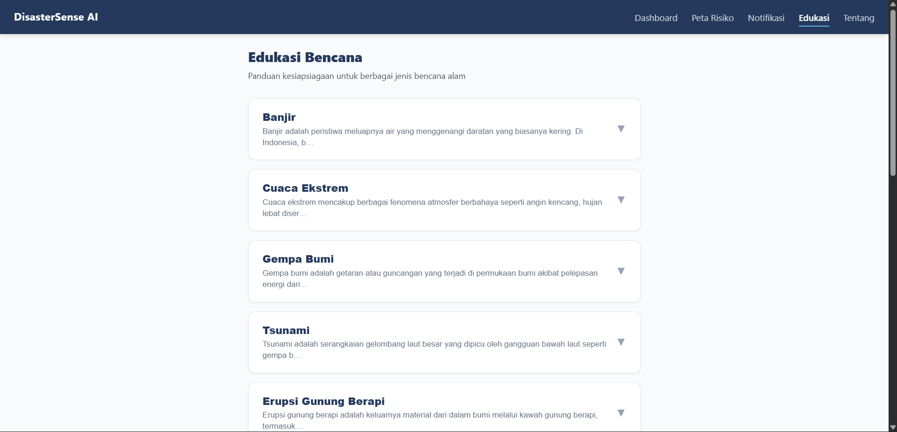
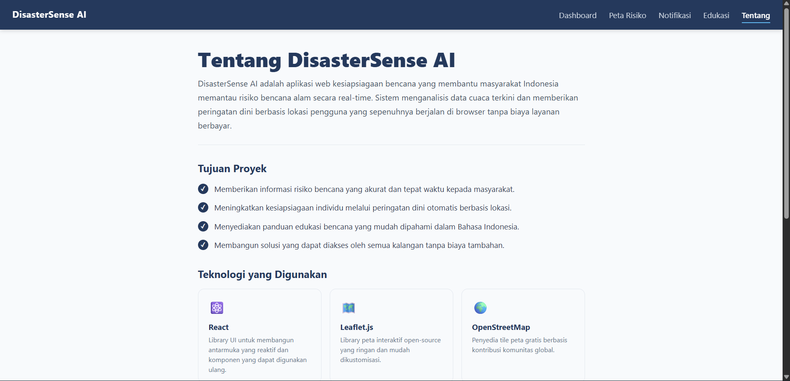

# 🌋 DisasterSense AI

<div align="center">


**Sistem peringatan dini bencana alam berbasis Artificial Intelligence (AI) untuk Indonesia**

</div>

---

## 📋 Deskripsi Proyek

**DisasterSense AI** adalah aplikasi web berbasis React dan TypeScript yang dirancang untuk membantu masyarakat Indonesia meningkatkan kesiapsiagaan terhadap bencana alam. Sistem ini menganalisis data cuaca real-time dari Open-Meteo API dan mengkalkulasi tingkat risiko bencana secara otomatis berdasarkan lokasi pengguna.

Aplikasi ini hadir untuk menjawab kebutuhan nyata masyarakat Indonesia yang tinggal di wilayah rawan bencana dan memberikan informasi risiko yang mudah dipahami, rekomendasi tindakan yang tepat, serta edukasi kebencanaan yang komprehensif, semuanya langsung di browser tanpa instalasi tambahan.

---

## 📑 Daftar Isi

- [Demo](#-demo)
- [Tampilan Aplikasi](#-tampilan-aplikasi)
- [Latar Belakang](#-latar-belakang)
- [Fitur Utama](#-fitur-utama)
- [Teknologi yang Digunakan](#-teknologi-yang-digunakan)
- [Arsitektur](#-arsitektur)
- [Struktur Proyek](#-struktur-proyek)
- [Cara Instalasi](#-cara-instalasi)
- [Cara Penggunaan](#-cara-penggunaan)
- [Peran Developer](#-peran-developer)
- [Pembelajaran dari Proyek](#-pembelajaran-dari-proyek-lessons-learned)
- [Ucapan Terima Kasih](#-ucapan-terima-kasih)

---

## 🎮 Demo

> Coming Soon

---

## 📸 Tampilan Aplikasi

### Landing Page




### Halaman Dashboard




### Halaman Peta Risiko




### Halaman Edukasi




### Halaman Notifikasi




### Halaman Tentang




---

## 🎯 Latar Belakang

Indonesia adalah salah satu negara paling rawan bencana di dunia, berada di Cincin Api Pasifik, memiliki lebih dari 127 gunung berapi aktif, dan menghadapi ancaman banjir, tsunami, gempa bumi, serta cuaca ekstrem setiap tahunnya.

Kebutuhan yang melatarbelakangi proyek ini:

- **Kurangnya akses informasi risiko yang mudah dipahami** banyak sistem peringatan dini yang terlalu teknis dan sulit diakses masyarakat umum
- **Minimnya edukasi kebencanaan yang terpusat** informasi tentang cara menghadapi bencana tersebar di berbagai sumber yang tidak terstruktur
- **Kebutuhan akan sistem yang bekerja real-time** kondisi cuaca berubah cepat, sehingga dibutuhkan analisis risiko yang selalu diperbarui
- **Pentingnya kesiapsiagaan berbasis lokasi** risiko bencana sangat bergantung pada lokasi geografis pengguna
- **Aksesibilitas tanpa instalasi** aplikasi berbasis browser memungkinkan siapa saja mengakses tanpa perlu mengunduh aplikasi
 **Kebutuhan akan proyek portfolio** yang mendemonstrasikan keterampilan dalam membuat website

---

## 🌟 Fitur Utama

### 📍 Deteksi Lokasi Otomatis
| Fitur             | Deskripsi                                              |
|-------------------|--------------------------------------------------------|
| GPS otomatis      | Mendeteksi lokasi pengguna via browser Geolocation API |
| Input manual      | Mendukung input nama kota atau koordinat (lat, lon)    |
| Reverse geocoding | Mengubah koordinat menjadi nama kota via Nominatim API |
| Persistensi       | Lokasi terakhir tersimpan di localStorage              |

### 🌤️ Data Cuaca Real-time
| Fitur           | Deskripsi                                                    |
|-----------------|--------------------------------------------------------------|
| Curah hujan     | Data presipitasi dalam mm/jam                                |
| Kecepatan angin | Data kecepatan angin dalam km/jam                            |
| Kelembaban      | Kelembaban relatif dalam persen                              |
| Suhu            | Suhu udara dalam derajat Celsius                             |
| Kode cuaca WMO  | Deskripsi kondisi cuaca (Cerah, Hujan, Badai, dll)           |
| Fallback stale  | Menampilkan data terakhir jika API tidak tersedia            |

### 🚨 Mesin Risiko Bencana
| Fitur                 | Deskripsi                                               |
|-----------------------|---------------------------------------------------------|
| Tiga level risiko     | Aman (hijau), Waspada (kuning), Bahaya (merah)          |
| Faktor pemicu         | Menampilkan parameter cuaca yang memicu status risiko   |
| Rekomendasi tindakan  | Saran tindakan spesifik sesuai level risiko             |
| Kalkulasi otomatis    | Risiko dihitung ulang setiap kali data cuaca diperbarui |

### 🗺️ Peta Risiko Interaktif
| Fitur | Deskripsi |
|-------|-----------|
| Peta Leaflet | Peta interaktif berbasis OpenStreetMap |
| Marker berwarna | Warna marker sesuai status risiko lokasi |
| Popup informasi | Klik marker untuk melihat detail cuaca dan risiko |
| Legenda peta | Keterangan warna risiko di sudut peta |
| Fallback offline | Pesan informatif jika tile peta tidak tersedia |

### 📚 Edukasi Bencana
| Bencana | Konten |
|---------|--------|
| Banjir | Tanda peringatan, langkah sebelum/saat/sesudah, checklist |
| Gempa Bumi | Tanda peringatan, langkah sebelum/saat/sesudah, checklist |
| Tsunami | Tanda peringatan, langkah sebelum/saat/sesudah, checklist |
| Erupsi Gunung Berapi | Tanda peringatan, langkah sebelum/saat/sesudah, checklist |
| Tanah Longsor | Tanda peringatan, langkah sebelum/saat/sesudah, checklist |
| Kebakaran Hutan | Tanda peringatan, langkah sebelum/saat/sesudah, checklist |
| Kekeringan | Tanda peringatan, langkah sebelum/saat/sesudah, checklist |
| Angin Puting Beliung | Tanda peringatan, langkah sebelum/saat/sesudah, checklist |
| Abrasi Pantai | Tanda peringatan, langkah sebelum/saat/sesudah, checklist |
| Banjir Bandang | Tanda peringatan, langkah sebelum/saat/sesudah, checklist |
| Cuaca Ekstrem | Tanda peringatan, langkah sebelum/saat/sesudah, checklist |

### 🔔 Sistem Notifikasi & Alert
| Fitur | Deskripsi |
|-------|-----------|
| Alert otomatis | Notifikasi saat status risiko berubah |
| Browser notification | Push notification via Web Notifications API |
| Riwayat alert | Histori seluruh perubahan status risiko |
| Snapshot cuaca | Setiap alert menyimpan data cuaca saat kejadian |

---

## 🛠️ Teknologi yang Digunakan

### Core Technologies
| Teknologi | Versi | Fungsi |
|-----------|-------|--------|
| **React** | 19.0 | UI library untuk membangun antarmuka komponen |
| **TypeScript** | 5.7 | Type safety dan developer experience yang lebih baik |
| **Vite** | 6.1 | Build tool dan dev server yang cepat |
| **React Router DOM** | 7.1 | Client-side routing antar halaman |
| **Zustand** | 5.0 | State management global yang ringan |
| **Leaflet + React Leaflet** | 1.9 | Peta interaktif berbasis OpenStreetMap |

### External APIs
| API | Fungsi |
|-----|--------|
| **Open-Meteo API** | Data cuaca real-time gratis tanpa API key |
| **Nominatim (OpenStreetMap)** | Reverse geocoding koordinat ke nama kota |

### Testing
| Library | Versi | Fungsi |
|---------|-------|--------|
| **Vitest** | 3.0 | Test runner berbasis Vite |
| **@testing-library/react** | 16.2 | Testing komponen React |
| **fast-check** | 3.23 | Property-based testing |
| **jsdom** | 26.0 | Simulasi DOM untuk testing |

---

## 🏗️ Arsitektur

### Logika Kalkulasi Risiko

```
Curah Hujan > 50 mm/jam  → Bahaya
Curah Hujan 10-50 mm/jam → Waspada
Kecepatan Angin > 70 km/jam  → Bahaya
Kecepatan Angin 40-70 km/jam → Waspada
Selain itu → Aman
```

---

## 📁 Struktur Proyek

```
disastersense-ai/
│
├── Screenshot                    # Tampilan Aplikasi
│   ├── 1.png                     # Landing Page
│   ├── 2.png                     # Dashboard
│   ├── 3.png                     # Peta Risiko
│   ├── 4.png                     # Notifikasi
│   ├── 5.png                     # Edukasi
│   └── 6.png                     # Tentang
│
├── index.html                    # Entry point HTML
├── package.json                  # Dependensi dan skrip npm
├── vite.config.ts                # Konfigurasi Vite
├── vitest.config.ts              # Konfigurasi Vitest
├── tsconfig.json                 # Konfigurasi TypeScript
│
└── src/
    ├── main.tsx                  # Entry point React
    ├── App.tsx                   # Root komponen + routing
    ├── declarations.d.ts         # Deklarasi tipe tambahan
    │
    ├── types/
    │   └── index.ts              # Semua interface dan tipe TypeScript
    │
    ├── store/
    │   └── appStore.ts           # Zustand global state store
    │
    ├── services/
    │   ├── locationService.ts    # GPS, geocoding, parsing input lokasi
    │   ├── weatherService.ts     # Fetch cuaca dari Open-Meteo API
    │   ├── riskEngine.ts         # Kalkulasi level risiko bencana
    │   ├── notificationService.ts# Logika alert dan browser notification
    │   ├── locationService.test.ts
    │   ├── weatherService.test.ts
    │   ├── riskEngine.test.ts
    │   └── notificationService.test.ts
    │
    ├── components/
    │   ├── Navbar.tsx             # Navigasi utama (desktop + mobile)
    │   ├── Navbar.css
    │   ├── Footer.tsx             # Footer dengan navigasi dan nomor darurat
    │   ├── Footer.css
    │   ├── RiskBadge.tsx          # Badge status risiko berwarna
    │   ├── LocationForm.tsx       # Form input lokasi manual
    │   ├── MapComponent.tsx       # Peta Leaflet interaktif
    │   ├── ErrorBoundary.tsx      # Penangkap error React
    │   ├── MapComponent.test.tsx
    │   └── RiskBadge.test.ts
    │
    ├── pages/
    │   ├── LandingPage.tsx        # Halaman pembuka dengan animasi
    │   ├── LandingPage.css
    │   ├── Dashboard.tsx          # Dashboard risiko utama
    │   ├── MapPage.tsx            # Halaman peta risiko
    │   ├── EducationPage.tsx      # Halaman edukasi bencana
    │   ├── NotificationsPage.tsx  # Halaman riwayat notifikasi
    │   ├── AboutPage.tsx          # Halaman tentang aplikasi
    │   └── Dashboard.test.tsx
    │
    ├── data/
    │   ├── educationData.ts       # Data edukasi 11 jenis bencana
    │   └── educationData.test.ts
    │
    ├── styles/
    │   └── global.css             # CSS global dan reset
    │
    └── test/
        └── setup.ts               # Konfigurasi setup testing
```

---

## 📥 Cara Instalasi

### Prasyarat

- **Node.js 18+** — [Download di nodejs.org](https://nodejs.org/)
- **npm** — Sudah termasuk bersama Node.js
- **Browser modern** — Chrome, Firefox, Edge, atau Safari terbaru

### Langkah-langkah

**1. Clone Repository**

```bash
git clone https://github.com/Chrisimana/disastersense-ai.git
cd disastersense-ai
```

**2. Install Dependensi**

```bash
npm install
```

**3. Jalankan Development Server**

```bash
npm run dev
```

**4. Build untuk Produksi**

```bash
npm run build
```

**5. Preview Build Produksi**

```bash
npm run preview
```

**6. Jalankan Test**

```bash
npm test
```

---

## 🎮 Cara Penggunaan

### 1. Pertama Kali Membuka Aplikasi

Saat pertama kali membuka, aplikasi akan meminta izin akses lokasi dari browser. Klik **Izinkan** untuk deteksi GPS otomatis, atau klik **Tolak** untuk memasukkan lokasi secara manual.

### 2. Dashboard Risiko

- Lihat **status risiko** saat ini (Aman / Waspada / Bahaya) beserta faktor pemicunya
- Pantau **data cuaca terkini** — suhu, kelembaban, curah hujan, kecepatan angin
- Cek **riwayat alert** terbaru langsung di dashboard
- Gunakan tombol **Ganti Lokasi** untuk memperbarui lokasi

### 3. Peta Risiko

- Buka halaman **Peta Risiko** untuk melihat visualisasi lokasi di peta
- Klik marker untuk melihat detail cuaca dan status risiko
- Warna marker: 🟢 Aman · 🟡 Waspada · 🔴 Bahaya

### 4. Edukasi Bencana

- Buka halaman **Edukasi** dan pilih jenis bencana
- Pelajari **tanda peringatan**, **langkah sebelum**, **saat**, dan **sesudah** bencana
- Gunakan **checklist kesiapsiagaan** untuk mempersiapkan diri

### 5. Notifikasi

- Halaman **Notifikasi** menampilkan seluruh riwayat perubahan status risiko
- Setiap alert mencatat lokasi, waktu, perubahan status, dan snapshot data cuaca

---

## 👨‍💻 Peran Developer

Proyek ini dikembangkan secara mandiri sebagai proyek portofolio untuk mendemonstrasikan kemampuan pengembangan aplikasi web modern dengan React dan TypeScript.

### Kontribusi per Area

| Area | Kontribusi |
|------|------------|
| **Arsitektur** | Merancang alur data dari lokasi → cuaca → risiko → notifikasi |
| **UI/UX** | Desain antarmuka responsif dengan tema biru gelap konsisten |
| **Landing Page** | Animasi gradient, blob dekoratif, dan efek fade-in |
| **Dashboard** | Quick stats, kartu cuaca, riwayat alert, akses cepat |
| **Peta Interaktif** | Integrasi Leaflet dengan marker dinamis dan popup |
| **Mesin Risiko** | Algoritma kalkulasi risiko berdasarkan parameter cuaca |
| **Edukasi** | Konten 11 jenis bencana alam Indonesia yang komprehensif |
| **State Management** | Implementasi Zustand store dengan async actions |
| **Testing** | Unit test dan property-based test untuk semua service |

---

## 📚 Pembelajaran dari Proyek (Lessons Learned)

### Keterampilan Teknis yang Diperoleh

#### 1. TypeScript untuk Keamanan Tipe

```typescript
// Interface yang jelas mencegah bug runtime
export interface WeatherData {
  rainfall: number;    // mm/jam
  windSpeed: number;   // km/jam
  humidity: number;    // %
  temperature: number; // °C
  weatherCode: number; // kode WMO
  timestamp: number;
  isStale: boolean;
}
```

#### 2. Zustand untuk State Management

```typescript
// Store yang bersih dengan async actions
export const useAppStore = create<AppStore>((set, get) => ({
  location: getCurrentLocation(), // load dari localStorage
  weather: null,
  riskResult: null,

  setLocation: async (location) => {
    set({ location, isLoadingWeather: true });
    const weather = await fetchWeather(location);
    const riskResult = calculate(weather);
    set({ weather, riskResult, isLoadingWeather: false });
  },
}));
```

#### 3. Stale Data Pattern

```typescript
// Fallback ke data terakhir jika API gagal
export async function fetchWeather(location: LocationData): Promise<WeatherData> {
  try {
    const data = await callApi(location);
    lastWeatherData = data;
    return data;
  } catch {
    if (lastWeatherData) return { ...lastWeatherData, isStale: true };
    throw err;
  }
}
```

#### 4. Property-Based Testing dengan fast-check

```typescript
// Menguji properti yang harus selalu benar untuk input apapun
it('status selalu salah satu dari tiga nilai valid', () => {
  fc.assert(fc.property(
    fc.float({ min: 0, max: 200 }),
    fc.float({ min: 0, max: 200 }),
    (rainfall, windSpeed) => {
      const result = calculate({ rainfall, windSpeed, ...defaults });
      return ['Aman', 'Waspada', 'Bahaya'].includes(result.status);
    }
  ));
});
```

#### 5. Leaflet dengan React

```typescript
// Manajemen marker yang efisien — hanya update yang berubah
markers.forEach((m) => {
  const key = `${m.lat},${m.lon}`;
  if (markersRef.current.has(key)) {
    // Update marker yang sudah ada
    existing.setIcon(icon);
  } else {
    // Tambah marker baru
    const marker = L.marker([m.lat, m.lon], { icon }).addTo(map);
    markersRef.current.set(key, marker);
  }
});
```
---

## 🙏 Ucapan Terima Kasih

### API & Data

- [**Open-Meteo**](https://open-meteo.com/) — API cuaca gratis dan open-source tanpa API key
- [**OpenStreetMap & Nominatim**](https://nominatim.openstreetmap.org/) — Geocoding dan peta gratis berbasis komunitas
- [**BMKG**](https://www.bmkg.go.id/) — Referensi data dan standar peringatan cuaca Indonesia
- [**BNPB**](https://www.bnpb.go.id/) — Referensi informasi kebencanaan Indonesia

### Library & Tools

- [**React**](https://react.dev/) — UI library yang powerful dan ekosistem yang luas
- [**Zustand**](https://zustand-demo.pmnd.rs/) — State management yang simpel dan efisien
- [**Leaflet**](https://leafletjs.com/) — Library peta open-source yang ringan
- [**Vite**](https://vitejs.dev/) — Build tool modern yang sangat cepat
- [**Vitest**](https://vitest.dev/) — Test runner yang terintegrasi sempurna dengan Vite
- [**fast-check**](https://fast-check.io/) — Property-based testing yang powerful
- [**Shields.io**](https://shields.io/) — Badge untuk README

### Dokumentasi Referensi

- [MDN Web Docs](https://developer.mozilla.org/) — Referensi Web API (Geolocation, Notifications, localStorage)
- [WMO Weather Codes](https://open-meteo.com/en/docs) — Standar kode cuaca internasional

---

<div align="center">

**⭐ Jika proyek ini bermanfaat, jangan lupa beri bintang! ⭐**

*"Kesiapsiagaan bukan soal takut pada bencana, tapi soal siap menghadapinya."*

</div>
